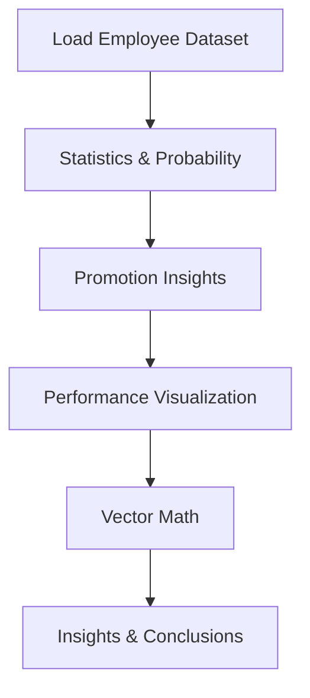

<div align="center">

# Employees Performance Practical

### Applied Employee Performance Analysis using Python

<br>

<p align="center">
  
  
  
  
  
  
</p>

<br>

<div align="center">
  <!-- Show the Tenor GIF directly; also provide a static/local fallback image that links to the Tenor page -->
  <a href="https://tenor.com/bfZT7" target="_blank" rel="noopener noreferrer">
    
  </a>
  
  <!-- If the host allows hotlinking the Tenor GIF, it will appear below the linked static image for viewers on platforms that support it -->
  <p>
    
  </p>
</div>

<br>

<p align="center">
  <a href="Employees_Performace_Practical.ipynb">
    
  </a>
  &nbsp;
  <a href="Part-A Theory.pdf">
    
  </a>
  &nbsp;
  <a href="employee_performance_dataset.csv">
    
  </a>
  &nbsp;  <a href="https://drive.google.com/file/d/10aOYHues0dtTrmSqII4ECA4dRO3TEbge/view?usp=sharing">
    
  </a>
  &nbsp;  <a href="https://github.com/DevanshiBachhote2007/Employees_Performance/issues">
    
  </a>
</p>

</div>

---

## Overview

> **What if employee performance could be explained with math?**

This project analyzes an employee dataset using Python and Jupyter Notebook. It combines statistics, probability, visualization, and vector math to show how salary, productivity, performance score, an[...] 

---

## Project Summary

The notebook covers the following practical tasks:

- Central tendency of `Salary` using mean, median, and mode
- Variance and standard deviation for `Projects_Completed`
- Promotion probability across the workforce
- Conditional probability of promotion for high performers
- Contingency table analysis of `Promotion_Status` by `Department`
- Histogram of `Performance_Score` with Gaussian fit
- Salary skewness and kurtosis analysis
- Q-Q plot of `Projects_Completed`
- Vector math with employee workload vectors

---

## Dataset Information

This repository uses the employee dataset `employee_performance_dataset.csv`, which contains records such as:

- `Employee_ID`
- `Department`
- `Age`
- `Salary`
- `Projects_Completed`
- `Working_Hours`
- `Performance_Score`
- `Promotion_Status`

The dataset supports statistical analysis, probability calculations, and linear algebra applications to real employee performance data.

---

## Project Workflow



---

## Topics Covered

| # | Topic |
|:-:|:------|
| 01 | Salary mean, median, mode |
| 02 | Variance and standard deviation |
| 03 | Promotion probability |
| 04 | Conditional probability (high performers) |
| 05 | Departmental contingency table |
| 06 | Histogram and Gaussian fit |
| 07 | Skewness and kurtosis |
| 08 | Q-Q plot |
| 09 | Employee workload vectors |
| 10 | Dot product, norms, and angles |

---

## Technologies Used

| Technology | Role |
|:----------:|:----:|
| Python | Core programming language |
| NumPy | Numerical calculations |
| Pandas | Data loading and manipulation |
| Matplotlib | Visualization |
| Seaborn | Statistical plotting |
| Jupyter Notebook | Interactive analysis |

---

## Practical Insights

- `Salary` is analyzed using mean, median, and mode to describe typical employee pay.
- `Projects_Completed` dispersion is measured with variance and standard deviation.
- Promotion probability is calculated as the share of employees who were promoted.
- High-performing employees (`Performance_Score > 80`) are shown to have a higher promotion rate.
- The contingency table reveals how promotion status varies by department.
- Distribution analysis shows how performance scores behave and whether they follow a normal pattern.
- Vector math compares employee work patterns using dot products, norms, and angles.

---

## Quick Start

```bash
# Clone the repository
git clone https://github.com/DevanshiBachhote2007/Employees_Performance.git
cd Employees_Performance

# Install dependencies
pip install numpy pandas matplotlib seaborn scipy

# Launch the notebook
jupyter notebook Employees_Performace_Practical.ipynb
```

---

## Notebook Walkthrough

This notebook is structured as a step-by-step practical. Below are the exact code sections from the notebook, with room to add output screenshots for each major step.

### Step 1 - Import Libraries and Load Dataset

```python
import numpy as np
import pandas as pd
import matplotlib.pyplot as plt
import seaborn as sns

data = pd.read_csv("employee_performance_dataset.csv")
data
```


---

### Step 2 - Central Tendency & Dispersion

```python
## 1. Find mean, median, and mode of Salary.
mean = np.mean(data['Salary'])
median = np.median(data['Salary'])
mode = pd.Series(data['Salary']).mode()[0]

print("Mean of Salary:", mean)
print("Median of Salary:", median)
print("Mode of Salary:", mode)
```

```python
## 2. Calculate variance and standard deviation of Projects_Completed.
variance = np.var(data['Projects_Completed'])
std_dev = np.std(data['Projects_Completed'])

print("Variance of Projects_Completed:", variance)
print("Standard Deviation of Projects_Completed:", std_dev)
```


---

### Step 3 - Probability & Events

```python
# 1. Find the probability of employees getting promoted.
prob_promotion = (data['Promotion_Status'] == 'Yes').mean()
print("Probability of Promotion:", prob_promotion)
```

```python
# 2. Create a contingency table between Promotion_Status and Department
cont_table = pd.crosstab(data['Department'], data['Promotion_Status'])
print(cont_table)
```

```python
# 3. Compute conditional probability: P(Promotion | Performance_Score >80).
high_perf = data[data['Performance_Score'] > 80]
cond_prob = (high_perf['Promotion_Status'] == 'Yes').mean()
print("P(Promotion | Performance_Score > 80):", cond_prob)
```


---

### Step 4 - Distributions & Visualization

```python
from scipy.stats import norm

plt.figure(figsize=(8,5))
sns.histplot(data['Performance_Score'], bins=20, kde=False, color='skyblue')
mu, sigma = norm.fit(data['Performance_Score'])
x = np.linspace(min(data['Performance_Score']), max(data['Performance_Score']), 100)
p = norm.pdf(x, mu, sigma)
plt.plot(x, p * len(data['Performance_Score']) * (max(data['Performance_Score']) - min(data['Performance_Score'])) / 20, 'r--', linewidth=2)
plt.title("Performance Score Histogram with Gaussian Fit")
plt.xlabel("Performance Score")
plt.ylabel("Frequency")
plt.show()
```

```python
skewness = data['Salary'].skew()
kurtosis = data['Salary'].kurt()
print("Skewness of Salary:", skewness)
print("Kurtosis of Salary:", kurtosis)
```

```python
import scipy.stats as stats
plt.figure(figsize=(6,6))
stats.probplot(data['Projects_Completed'], dist="norm", plot=plt)
plt.title("Q-Q Plot of Projects Completed")
plt.show()
```


---

### Step 5 - Linear Algebra Application

```python
vectors = data[['Projects_Completed', 'Working_Hours']].head(5).values
print("Employee Vectors:\n", vectors)

dot_product = np.dot(vectors[0], vectors[1])
print("Dot Product (Emp1 · Emp2):", dot_product)
```

```python
norm1 = np.linalg.norm(vectors[0], 1)
norm2 = np.linalg.norm(vectors[0], 2)
print("Norm-1 of Emp1:", norm1)
print("Norm-2 of Emp1:", norm2)
```

```python
cos_theta = np.dot(vectors[0], vectors[1]) / (np.linalg.norm(vectors[0]) * np.linalg.norm(vectors[1]))
angle = np.degrees(np.arccos(cos_theta))
print("Angle between Emp1 and Emp2:", angle, "degrees")
```


---

## Files in this repository

- `Employees_Performace_Practical.ipynb` — Practical notebook
- `employee_performance_dataset.csv` — Employee dataset
- `Part-A Theory.pdf` — Supporting theory document
- `math-animation.gif` — Math-themed animation for README
- `README.md` — Project documentation

---

## Author

**Devanshi Bachhote**

